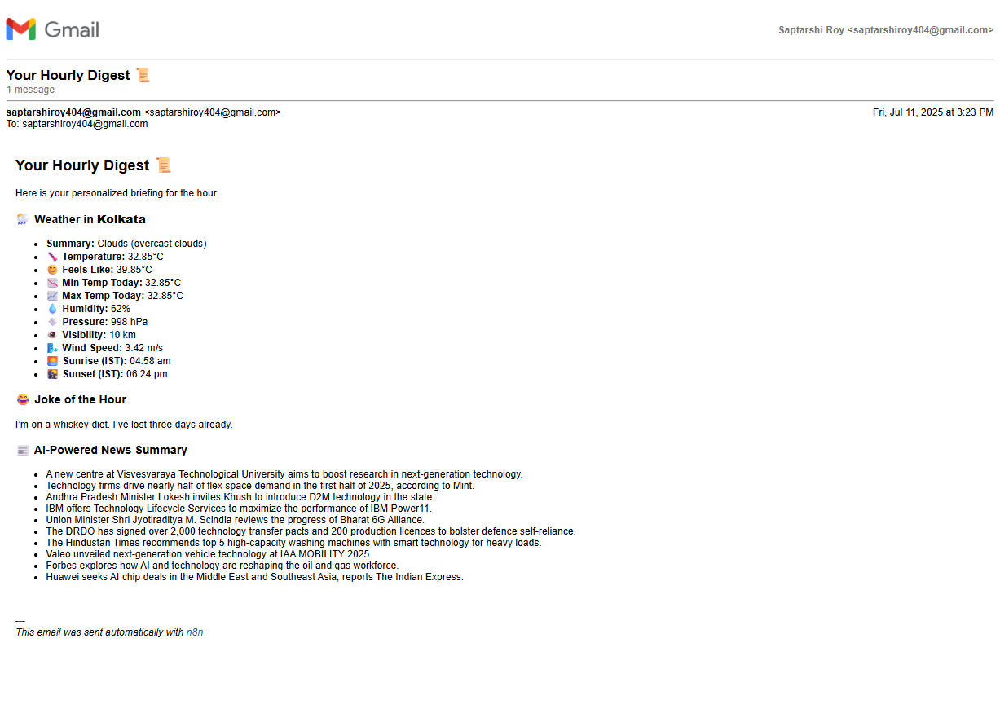
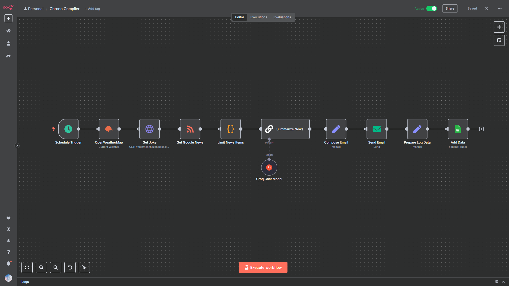

# ⏳ Chrono Compiler

**Chrono Compiler** is an AI-powered, automated email digest built with [n8n](https://n8n.io). It compiles a personalized, hourly email that includes:

* 🌦️ Real-time **Weather Updates**
* 😂 A random **Joke**
* 📰 An **AI-generated tech-news summary** from top headlines
* 📗 **Activity logs** stored in Google Sheets

*All packaged into a **clean**, **formatted email** — **sent automatically every hour**.*

---

## 📬 Example Email Output

Here is a sample of the final email generated by the workflow:

  <a href="email-example.pdf">👁️ Email Example (PDF)</a>

---

## 🚀 Features

| ***FEATURE***            | ***DESCRIPTION***                                                                            |
| ------------------------ | -------------------------------------------------------------------------------------------- |
| **🌦️ Hourly Weather**    | Fetches real-time weather data from **OpenWeatherMap**.                                      |
| **😂 Joke of the Hour**  | Pulls a light-hearted joke from **icanhazdadjoke API**.                                      |
| **📰 AI News Summary**   | Extracts trending headlines via **Google News** RSS & summarizes using **Gemeni 2.5 Flash**. |
| **📧 Email Digest**      | Formats the content and sends a professional-looking email using **Gmail**.                  |
| **📗 Execution Log**     | Logs each workflow run in **Google Sheets** for tracking.                                    |

---

## ⚙️ Workflow Overview

Here is a visual overview of the n8n workflow:

---

## 🛠️ Tech Stack

|***TOOL / SERVICE***    | ***PURPOSE***                         |
| ---------------------- | ------------------------------------- |
| **n8n**                | Workflow orchestration engine         |
| **Docker**             | Containerized local deployment        |
| **OpenWeatherMap API** | Fetch weather data                    |
| **icanhazdadjoke API** | Retrieve random jokes                 |
| **Google News (RSS)**  | Pull trending news headlines          |
| **Gemeni API**         | Summarize news using LLM              |
| **Gmail SMTP**         | Send email digests                    |
| **Google Sheets**      | Log and store workflow execution data |

---

## ✒️ How to Use Chrono Compiler

This guide assumes you have an **n8n instance running** (locally or in the cloud).

### 1️⃣ Download & Import Workflow

Download [`Chrono Compiler.json`](Chrono%20Compiler.json) and import it into n8n:
- Open n8n at `http://localhost:5678`
- Go to **Workflows → + New → Import from File**
- Select the downloaded file

### 2️⃣ Set Up Credentials

In **Credentials**, add API keys for:
- **OpenWeatherMap API** — [Get key](https://openweathermap.org/api)
- **Gmail SMTP** — Your Gmail account
- **Google Sheets OAuth2** — Google account authentication
- **Google Gemini API** — [Get key](https://aistudio.google.com/app/apikey)

### 3️⃣ Save and Run

Once all ***Credentials*** are configured:
- Click **Save** to store your workflow
- Click **Execute Workflow** to run Chrono Compiler
- Monitor the execution to ensure all nodes complete successfully

---

## 👨‍💻 Author

Made with **[n8n](https://n8n.io/)** by **[Saptarshi Roy](https://github.com/saptarshiroy39)**

---