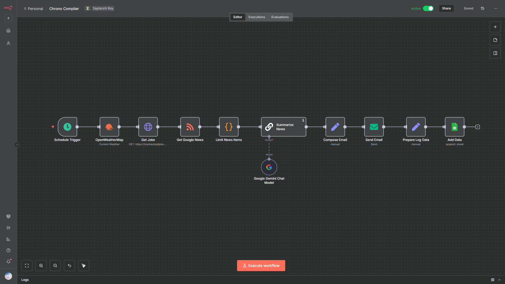

# Chrono Compiler 📜✨

Chrono Compiler is a personal automation project built with n8n. It acts as an hourly digital digest, compiling and sending a personalized email with the latest weather, a random joke, and an AI-powered news summary.

## Example Email 📧

Here is a sample of the final email generated by the workflow:


## Features 🚀

-   **🌦️ Hourly Weather:** Fetches real-time weather data for any specified location.
-   **😂 Joke of the Hour:** Grabs a random joke to add a bit of fun to the update.
-   **📰 AI News Summary:** Reads a Google News RSS feed, and uses a Large Language Model (LLM) to create a concise, bulleted summary of the latest headlines.
-   **📧 Email Digest:** Compiles all the information into a beautifully formatted HTML email.
-   **📊 Activity Logging:** Logs every execution to a Google Sheet for tracking.

## Workflow Overview ⚙️

Here is a visual overview of the n8n workflow:



## Technologies Used 🛠️

-   **Core:** [n8n](https://n8n.io/)
-   **Hosting:** [Docker](https://www.docker.com/)
-   **APIs & Services:**
    -   OpenWeatherMap API
    -   icanhazdadjoke API
    -   Google News (via RSS)
    -   Groq API (for AI summarization)
    -   Gmail (for sending emails)
    -   Google Sheets

## Setup & Installation 📋

To run this project yourself, follow these steps:

1.  **Clone the repository:**
    ```bash
    git clone https://github.com/saptarshiroy39/chrono-compiler.git
    cd chrono-compiler
    ```

2.  **Create a `.env` file:** This project uses environment variables to keep API keys and other secrets safe. Create a file named `.env` in the project folder and add your credentials. Use the `.env.example` file as a template.

3.  **Run with Docker Compose:** Make sure you have Docker installed, then run:
    ```bash
    docker-compose up -d
    ```
    This will start an n8n instance on `http://localhost:5678`.

4.  **Import the Workflow:**
    -   Navigate to `http://localhost:5678`.
    -   From the main menu, select **Workflows**.
    -   Click **Import from File** and select the `ChronoCompilerWorkflow.json` file from this project.

5.  **Configure Credentials:**
    -   In the n8n sidebar, go to the **Credentials** section.
    -   Create new credentials for each service used (OpenWeatherMap, Groq, Gmail SMTP, Google Sheets OAuth2).
    -   **Important:** When the workflow asks for an API key or secret, use an n8n expression to read from the environment variables you set up. For example:
        -   For your Groq API Key, use the expression: `{{ $env.GROQ_API_KEY }}`
        -   For your OpenWeatherMap API Key, use: `{{ $env.OPENWEATHERMAP_API_KEY }}`